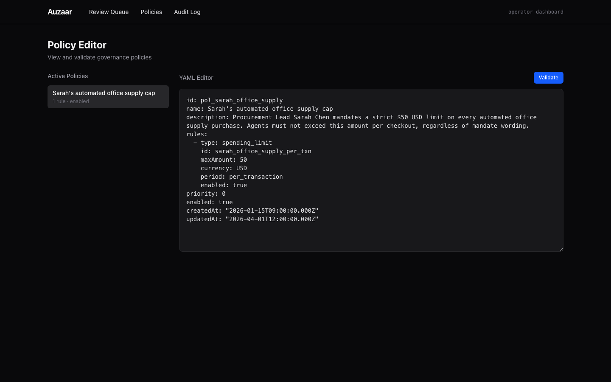
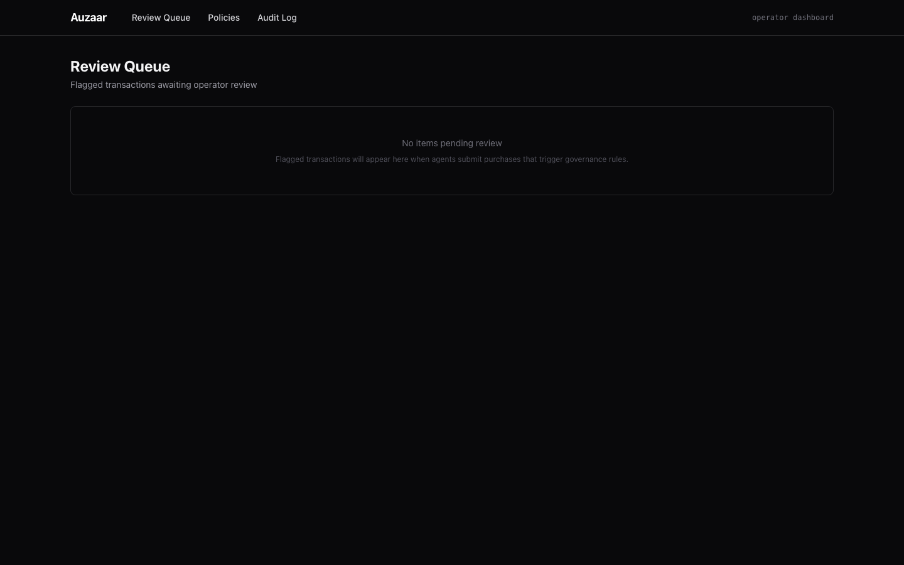

# Auzaar

**Buyer-side agent governance for agentic commerce.**

When an AI agent spends your money, who's checking the work? Auzaar sits between AI agents and merchant-side commerce protocols (ACP, UCP, AP2) and intercepts every outbound commerce action — validating intent, enforcing policy, scoring risk, and producing a tamper-evident audit trail before any transaction is released.

---

## Screenshots

**Audit log** — immutable, hash-chained record of every governance event. The screenshot below is real output from `npm run demo`: a transaction submitted, governance started, then blocked by a deterministic spending rule.


**Policy editor** — view and validate YAML governance policies with the rule schema rendered inline.


**Review queue** — operator surface for flagged transactions awaiting approve/reject (empty state shown).


---

## What this demonstrates

- **4-stage governance pipeline** — deterministic rules → ML threat detection → intent alignment → statistical anomaly detection, with composite risk scoring and operator triage routing
- **Hash-chained append-only event log** — every decision is signed (Ed25519) and chained for tamper-evidence
- **Hybrid heuristic + ML inference** — every stage falls back to deterministic logic if its model isn't loaded; all inference runs locally (ONNX Runtime + `node-llama-cpp`)
- **Closed-loop feedback** — operator approve/reject decisions feed back into training data and update per-agent spending baselines (Welford's online algorithm)
- **MCP server + HTTP proxy** — agents integrate via Model Context Protocol tools or a transparent reverse proxy that intercepts ACP/UCP/AP2 calls

## Architecture

```
Agent → MCP / Proxy → [ Rules → Threat → Intent → Spending Graph ] → Triage → Release
                              ↓                                          ↓
                         Event Log (hash-chained, signed)         Operator Dashboard
```

Each stage can hard-block or soft-flag. Hard rules short-circuit ML stages. The SLM triage router has routing authority but never decision authority — it can't auto-approve above a configurable ceiling, can't override a hard block.

## Packages

| Package | Purpose |
|---|---|
| `@auzaar/core` | Types, Zod schemas, crypto utils |
| `@auzaar/mandate-service` | Mandate capture, versioning, signing |
| `@auzaar/governance-engine` | Rules + ML stages + triage + scoring |
| `@auzaar/event-log` | Append-only hash-chained audit trail |
| `@auzaar/agent-registry` | Agent identity, delegation chains, trust scoring |
| `@auzaar/ingestion` | MCP server + API proxy + auth + rate limiting |
| `@auzaar/protocol-release` | Attestation headers and downstream release |
| `@auzaar/feedback-pipeline` | Operator feedback → training data + baselines |
| `@auzaar/dashboard` | Next.js operator UI (queue / policies / audit) |

## Stack

- **Language:** TypeScript (strict)
- **Runtime:** Node.js 22+
- **Monorepo:** Turborepo + npm workspaces
- **Validation:** Zod
- **MCP:** `@modelcontextprotocol/sdk`
- **ML inference:** ONNX Runtime (DistilBERT threat classifier, cross-encoder for intent), `node-llama-cpp` (Llama-3.2-1B / Phi-3-mini for SLM triage)
- **Dashboard:** Next.js 15, Tailwind
- **Testing:** Vitest (148 tests across 11 packages)
- **Signing:** Ed25519 (Node crypto)

## Run locally

```bash
npm install
npm run build
npm run test
npm run demo                                    # interactive CLI demo
npm run dev --workspace @auzaar/dashboard       # operator UI on :3200
```

## Status

Phase 1 complete (all 9 packages, 148 passing tests). Phase 2 in progress — ML threat detection, intent alignment, spending anomaly detection, SLM triage routing, and the operator-feedback training loop.

---

Built by [Aryan Arun](https://github.com/aryanarun).
