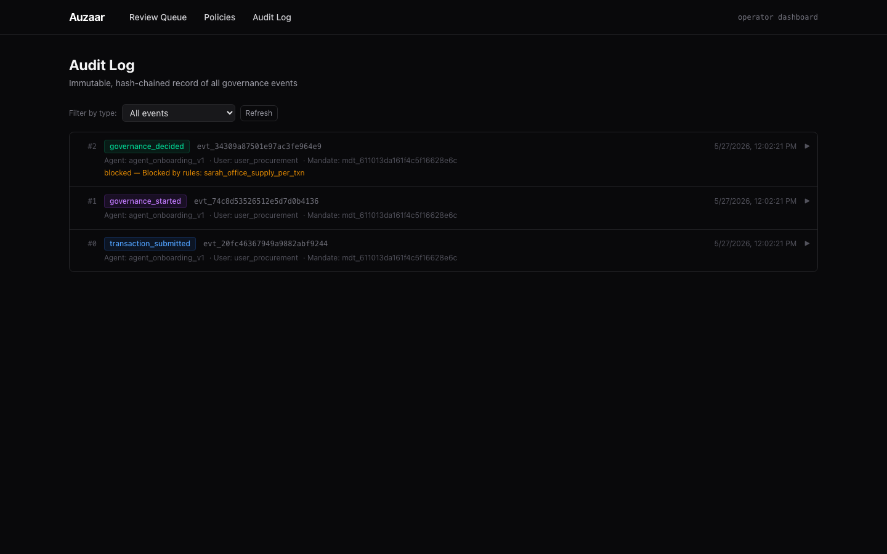

# Auzaar

**Governance and security for AI agents.** Two complementary surfaces in this monorepo:

| Subproject | What it is | UI |
|---|---|---|
| [`security-gateway/`](./security-gateway) | MCP Security Gateway PoC — Python + Next.js. Intercepts AI-agent tool calls, scans with deterministic regex + local SLM, blocks high-risk calls in <40ms, surfaces a real-time dashboard with cost-of-breach estimates for engineers and executives. Demonstrates blocking a supply-chain XPIA. | Trident-branded operator + executive dashboard |
| [`governance-engine/`](./governance-engine) | The next-generation rewrite — TypeScript monorepo (Turborepo + 9 packages, 148 tests). 4-stage governance pipeline (rules → ML threat → intent alignment → spending-graph anomalies), hash-chained signed event log, MCP server, HTTP proxy, operator dashboard. Built around AP2 / UCP / ACP. | Operator review queue + policy editor + audit log |

The two share a thesis — *AI agents need a buyer-side governance layer* — and represent different points in the architecture journey. The Security Gateway PoC proved the interception loop and the executive risk-framing UI; the Governance Engine extends it to agentic commerce with a typed, testable, multi-protocol pipeline.

---

## Quick previews

### Security Gateway — Developer dashboard

`Total Exposure $18.6M · CRITICAL 1 · TOOLS 3`. Live DEV TRACE stream with per-stage latencies (scan.deterministic, scan.slm, register.complete, intercept.lookup, intercept.blocked, blast_radius, execute.complete).


### Security Gateway — Executive view

Same data, board-ready. Total exposure → potential incident cost band → compliance frameworks → concrete leadership recommendation. `Export Report →` button.


### Governance Engine — Operator audit log

Immutable, hash-chained record of every governance event. Real output from `npm run demo`: a transaction submitted, governance started, then blocked by a deterministic spending rule.



### Governance Engine — Policy editor

View and validate YAML governance policies with the rule schema rendered inline.


---

## Run either subproject

```bash
# Security Gateway (Python + Next.js)
cd security-gateway
./scripts/run_demo.sh --no-llm    # full stack on :8001 + :8002 + :3000
# In another terminal:
source .venv/bin/activate && python -m agent.agent

# Governance Engine (TypeScript monorepo)
cd governance-engine
npm install && npm run build && npm run test
npm run demo                                    # interactive CLI demo
npm run dev --workspace @auzaar/dashboard       # operator UI on :3200
```

Full setup instructions in each subproject's README.

---

## Repo layout

```
auzaar/
├── README.md                       # this file
├── security-gateway/               # MCP Security Gateway PoC (Python + Next.js)
│   ├── gateway/                    # FastAPI gateway, scanners, interceptor
│   ├── mcp_server/                 # Target MCP server + tools + tickets
│   ├── agent/                      # Autonomous agent (XPIA trigger)
│   ├── dashboard/                  # Next.js operator + executive UI
│   ├── scripts/run_demo.sh         # one-command full stack
│   └── docs/screenshots/           # UI captures
└── governance-engine/              # Governance Engine (TypeScript monorepo)
    ├── packages/                   # 9 packages: core, mandate, engine, event-log, ...
    ├── policies/                   # YAML governance policy examples
    ├── eval/                       # eval harness + datasets
    └── docs/screenshots/           # dashboard captures
```

---

Built by [Aryan Arun](https://github.com/aryanarun).
